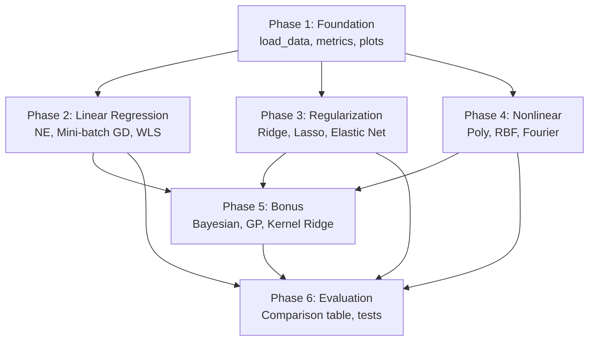

# Kế hoạch Thực hiện Part1: Regression

## Bối cảnh

### Dataset
- **Bike Sharing Dataset** (UCI ML Repository) — file `hour.csv`
- **17,379 mẫu**, 17 cột (instant, dteday, season, yr, mnth, hr, holiday, weekday, workingday, weathersit, temp, atemp, hum, windspeed, casual, registered, **cnt**)
- **Target**: `cnt` (tổng số xe đạp cho thuê)
- EDA & preprocessing đã được thực hiện bởi thành viên A tại `code/Part1_Regression/data/`

### Skills đã cài đặt

| Skill | Nguồn | Installs | Mục đích |
|-------|--------|----------|----------|
| `scikit-learn` | davila7/claude-code-templates | 382 | Templates cho regression, cross-validation, pipelines |
| `seaborn` | davila7/claude-code-templates | 285 | Visualization: residuals, QQ-plot, heatmap, learning curves |
| `scikit-learn-best-practices` | mindrally/skills | 108 | Best practices cho model evaluation, feature selection |

> [!NOTE]
> Skill `data-analysis` (supercent-io, 13.8K installs) không cài được do repo private. Tuy nhiên 3 skills đã cài đủ cover toàn bộ workflow cần thiết.

---

## Cấu trúc File đề xuất

```
code/Part1_Regression/
├── models/
│   ├── __init__.py
│   ├── linear_regression.py        # Normal Equations + Mini-batch GD
│   ├── regularized_regression.py   # Ridge, Lasso, Elastic Net (from scratch)
│   ├── nonlinear_models.py         # Polynomial, RBF, custom basis
│   ├── bonus_models.py             # Bayesian, GP, Kernel Ridge, Robust
│   └── feature_selection.py        # Forward, Backward, Lasso-based
├── data/
│   ├── 01_eda.ipynb               # [Đã có - thành viên A]
│   ├── 02_preprocessing.ipynb     # [Đã có - thành viên A]
│   └── load_data.py               # Helper: load processed data
├── research-experiments/
│   └── notebook.ipynb             # [Đã có]
├── evaluation/
│   ├── __init__.py
│   ├── metrics.py                 # MSE, RMSE, MAE, R² + k-fold CV
│   ├── plots.py                   # Learning curves, residuals, pred vs actual
│   └── statistical_tests.py       # Paired t-test, Wilcoxon
├── notebooks/
│   ├── 03_linear_regression.ipynb       # Section 1.1
│   ├── 04_regularization.ipynb          # Section 1.2  
│   ├── 05_nonlinear_models.ipynb        # Section 1.3
│   ├── 06_bonus.ipynb                   # Section 2 (Bonus)
│   └── 07_evaluation_comparison.ipynb   # Section 3
├── utils.py                       # [Đã có] set_seed, load_dataset,...
└── plan.md                        # [Đã có]
```

---

## Phân tích Công việc Chi tiết

### Phase 1: Foundation — Utilities & Data Loading

> [!IMPORTANT]
> Phải hoàn thành trước khi bắt đầu bất kỳ model nào.

#### [NEW] `code/Part1_Regression/data/load_data.py`
- Load processed data từ `data/processed/regression/`
- Nếu processed chưa có → load từ `data/raw/regression/hour.csv` và xử lý cơ bản
- Return `X_train, X_val, X_test, y_train, y_val, y_test`
- Sử dụng `utils.train_val_test_split()` đã có sẵn

#### [NEW] `code/Part1_Regression/evaluation/metrics.py`
- Cài đặt từ đầu: `mse()`, `rmse()`, `mae()`, `r_squared()`
- `k_fold_cv()`: k-fold cross-validation (k=10) trả về mean ± std cho mỗi metric
- `cross_validate_model()`: wrapper nhận model + data → dict chứa tất cả metrics

#### [NEW] `code/Part1_Regression/evaluation/plots.py`
- `plot_learning_curves()`: train/val loss theo số mẫu
- `plot_residuals()`: scatter residuals + histogram
- `plot_predicted_vs_actual()`: y_pred vs y_true với đường 45°
- `plot_qq()`: QQ-plot cho residuals
- `plot_regularization_path()`: hệ số w theo log(λ)
- `plot_validation_curve()`: MSE theo bậc/số basis functions
- Tất cả biểu đồ có title, axis labels, legend (đủ để đưa vào báo cáo)

#### [NEW] `code/Part1_Regression/evaluation/statistical_tests.py`
- `paired_t_test()`: so sánh 2 model trên cùng folds
- `wilcoxon_test()`: nonparametric alternative

---

### Phase 2: Linear Regression (Section 1.1)

#### [NEW] `code/Part1_Regression/models/linear_regression.py`

| Task | Hàm/Class | Chi tiết |
|------|-----------|----------|
| Normal Equations | `class NormalEquationLR` | Cài đặt $w = (X^TX)^{-1}X^Ty$ từ đầu, **KHÔNG** dùng `sklearn.LinearRegression` |
| Mini-batch GD | `class MiniBatchGDLR` | SGD với batch size, learning rate schedule (step decay + cosine annealing), lưu loss history |
| Gauss-Markov check | `gauss_markov_diagnostics()` | Residual plot, QQ-plot, Breusch-Pagan test (dùng `statsmodels`) |
| WLS | `class WeightedLeastSquares` | Áp dụng khi Breusch-Pagan phát hiện heteroscedasticity |

#### [NEW] `code/Part1_Regression/notebooks/03_linear_regression.ipynb`
- Markdown lý thuyết cho mỗi phương pháp
- Chạy NE và Mini-batch GD, so sánh tốc độ hội tụ (plot)
- Kiểm tra Gauss-Markov: vẽ residual, QQ-plot, chạy Breusch-Pagan
- Nếu heteroscedasticity → chạy WLS và so sánh
- In metrics, lưu vào biến Python

---

### Phase 3: Regularization & Feature Selection (Section 1.2)

#### [NEW] `code/Part1_Regression/models/regularized_regression.py`

| Task | Hàm/Class | Chi tiết |
|------|-----------|----------|
| Ridge (L2) | `class RidgeRegression` | Cài đặt closed-form: $w = (X^TX + λI)^{-1}X^Ty$ |
| Lasso (L1) | `class LassoRegression` | Cài đặt bằng coordinate descent |
| Elastic Net | `class ElasticNetRegression` | Kết hợp L1+L2, tối ưu $(λ_1, λ_2)$ |
| λ selection | `select_lambda_cv()` | k-fold CV (k=10), grid search + warm start (Lasso path) |

#### [NEW] `code/Part1_Regression/models/feature_selection.py`

| Task | Hàm/Class | Chi tiết |
|------|-----------|----------|
| Forward Stepwise | `forward_stepwise_selection()` | Thêm feature tốt nhất mỗi bước |
| Backward Elimination | `backward_elimination()` | Loại feature kém nhất mỗi bước |
| Lasso-based | `lasso_feature_selection()` | Chọn features có hệ số ≠ 0 |

#### [NEW] `code/Part1_Regression/notebooks/04_regularization.ipynb`
- Lý thuyết Ridge, Lasso, Elastic Net
- Vẽ regularization path: hệ số w theo log(λ) cho Ridge và Lasso
- Grid search λ tốt nhất với 10-fold CV
- Phân tích vùng tối ưu (λ₁, λ₂) cho Elastic Net (heatmap)
- So sánh 3 phương pháp feature selection
- Metrics + phân tích kết quả

---

### Phase 4: Nonlinear Basis Functions & Ablation (Section 1.3)

#### [NEW] `code/Part1_Regression/models/nonlinear_models.py`

| Task | Hàm/Class | Chi tiết |
|------|-----------|----------|
| Polynomial | `class PolynomialRegression` | Mở rộng features bằng đa thức bậc d |
| Gaussian RBF | `class RBFRegression` | Gaussian basis: $ϕ_j(x) = \exp(-\|x-μ_j\|^2/2σ²)$ |
| Custom basis | `class FourierBasisRegression` | Fourier basis (sin/cos) — phù hợp với dữ liệu bike sharing có tính chu kỳ |
| Interaction terms | `add_interaction_terms()` | Thêm $x_ix_j$ vào feature set |

#### [NEW] `code/Part1_Regression/notebooks/05_nonlinear_models.ipynb`
- Lý thuyết cho 3 loại basis functions
- Validation curve: MSE theo bậc đa thức / số basis functions
- Ablation study: loại bỏ từng nhóm features / basis, đo ΔMSE
- Phân tích interaction effects: so sánh có/không có $x_ix_j$
- Metrics + phân tích

---

### Phase 5: Bonus (+5 điểm) (Section 2)

#### [NEW] `code/Part1_Regression/models/bonus_models.py`

| Task | Class/Hàm | Chi tiết |
|------|-----------|----------|
| Bayesian Regression | `class BayesianLinearRegression` | Posterior $p(w\|t)$, predictive distribution $\bar{f}^* ± 2σ_N$ |
| Evidence Maximization | `class EvidenceMaximization` | EM-style re-estimation cho α, β |
| Kernel Ridge | `class KernelRidgeRegression` | RBF kernel + Polynomial kernel, bandwidth bằng CV |
| GP Regression | `class GaussianProcessRegression` | RBF kernel, log-marginal-likelihood optimization |
| Robust Regression | `class RobustRegression` | IRLS với Huber loss/Student-t |
| Bias-Variance | `bias_variance_bootstrap()` | Bootstrap 200 lần, ước lượng bias² và variance |

#### [NEW] `code/Part1_Regression/notebooks/06_bonus.ipynb`
- Mỗi model: lý thuyết → code → kết quả → phân tích
- Vẽ predictive distribution + error bars (Bayesian, GP)
- So sánh Evidence Max vs CV (chất lượng + thời gian)
- So sánh Kernel Ridge vs Ridge tuyến tính
- IRLS robustness: inject outliers, so sánh với OLS
- Bootstrap bias-variance tradeoff plot với regularization path

---

### Phase 6: Evaluation & Comparison (Section 3)

#### [NEW] `code/Part1_Regression/notebooks/07_evaluation_comparison.ipynb`

| Task | Chi tiết |
|------|----------|
| Metrics cơ bản | MSE, RMSE, MAE, R² trên test set cho mọi model |
| Learning curves | Train/val loss theo số mẫu cho các model chính |
| Residual plots | Cho mọi model — kiểm tra tính ngẫu nhiên |
| Predicted vs Actual | Scatter plot cho mọi model |
| 10-fold CV | mean ± std cho mọi metrics, mọi model |
| Bảng tổng hợp | DataFrame so sánh tất cả models |
| Statistical tests | Paired t-test / Wilcoxon giữa các cặp model |

---

## Thứ tự thực hiện & Dependencies



---

## Quy tắc quan trọng

1. **Reproducibility**: Gọi `set_seed(42)` ở đầu mỗi notebook
2. **Từ đầu**: Linear Regression (NE, GD), Ridge, Lasso, Elastic Net phải implement from scratch — **KHÔNG** dùng `sklearn` cho phần train. Chỉ dùng `sklearn` để kiểm chứng.
3. **Notebook format**: Mỗi section phải có 3 phần: Markdown lý thuyết → Code → Markdown phân tích
4. **Metrics**: Tất cả metrics phải in ra + lưu biến Python để tổng hợp
5. **Biểu đồ**: Đủ title, axis labels, legend, figure size phù hợp

---

## Open Questions

> [!IMPORTANT]
> 1. **Processed data**: Thành viên A đã hoàn thành preprocessing chưa? Cần xác nhận format output (X_train, y_train,...) để `load_data.py` tương thích.
> 2. **Target variable**: Dùng `cnt` (tổng) hay cần thử cả `casual` + `registered` riêng?
> 3. **Feature engineering**: Có cần thêm feature mới (ví dụ: `rush_hour`, `is_weekend`) hay dùng đúng features từ preprocessing pipeline?

> [!WARNING]
> 4. **Deadline**: Theo plan, Phase 2 (Model) phải xong **30/3**, Phase 3 (Evaluation) xong **2/4**. Thời gian rất gấp — cần ưu tiên hoàn thành core (Section 1) trước, bonus sau.

---

## Verification Plan

### Automated Tests
- Chạy tất cả notebooks end-to-end: `jupyter nbconvert --execute *.ipynb`
- so sánh kết quả model from-scratch vs sklearn equivalent (sai số < 1%)
- Unit test cho metrics: so sánh `mse()` custom vs `sklearn.metrics.mean_squared_error`

### Manual Verification
- Review biểu đồ: có đủ labels, ý nghĩa kết quả
- Kiểm tra bảng tổng hợp cuối: đầy đủ models, metrics  
- Chạy lại từ đầu trên fresh kernel → kết quả giống nhau (reproducibility)
